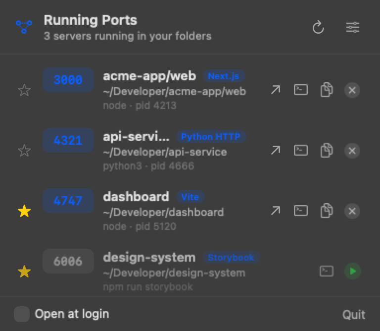

# PortHole

A macOS menu-bar app that shows the dev servers you have running — which project, on which port — and lets you copy the URL, open it, jump to its folder in a terminal, stop it, or bookmark it to start again later.

No more `lsof -i :3000` to remember what's on which port.



## Features

- **Live list of running dev servers** — discovered from listening TCP ports, refreshed automatically.
- **Knows your projects** — names each server from its working directory (monorepo-aware, e.g. `acme-app/web`) and detects the tool (Storybook, Vite, Next.js, Angular, Django, Rails, and more).
- **Only your stuff** — filters to servers started from your project folders (default `~/Documents`, configurable), hiding Docker, editors, and system services.
- **One ⋯ menu per server** — every action in a single, tidy dropdown: copy `http://localhost:<port>`, open in browser, open the folder in your terminal or editor, restart, stop, or force-stop.
- **Bookmark & restart** — star a project so it stays in the list when stopped, then start it again (command auto-detected from `package.json`, editable). Failed starts flag themselves with a **View Log** action.
- **Live notifications** — a banner and sound the moment a server goes live, whether you started it in a terminal or with the ▶ button.
- **Native feel** — frosted menu-bar popover, light/dark aware, "Open at login".

## Requirements

- macOS 14 or later
- Xcode / Swift toolchain (to build)

## Build & install

```bash
git clone <your-repo-url> PortHole
cd PortHole
./build-app.sh
cp -r PortHole.app /Applications/
open /Applications/PortHole.app
```

`build-app.sh` compiles a release build and assembles `PortHole.app`. The app lives in the menu bar only (no Dock icon).

## Usage

Click the menu-bar icon to open the popover. Each server row has one **⋯ actions menu**:

- **Open in Browser** — open `http://localhost:<port>`.
- **Copy URL** — copy the localhost URL.
- **Open in Terminal / Editor** — open the project folder in your terminal or editor.
- **Restart** — stop and start a bookmarked server in one step.
- **Stop / Force Stop** — SIGTERM, or SIGKILL if it won't quit.
- **Start** — launch a bookmarked, stopped project.
- **Bookmark / Remove Bookmark** — keep a project listed when it's stopped.
- **View Log** — open a started project's output (handy when a start fails).

**⚙︎ Settings** — choose your terminal and editor apps, toggle live-server
notifications, manage project folders, and edit bookmark launch commands.

## How it works

PortHole shells out to `lsof` to find listening TCP ports and `ps` to read each
process's command line, then maps ports back to projects using the process
working directory. Stopping sends `SIGTERM`; starting runs the project's command
detached in a login shell so it keeps running after PortHole quits. It needs no
special permissions and makes no network requests.

## License

[MIT](LICENSE)
